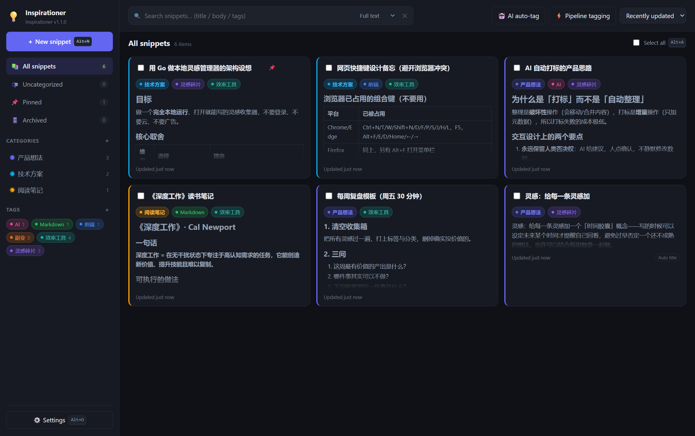
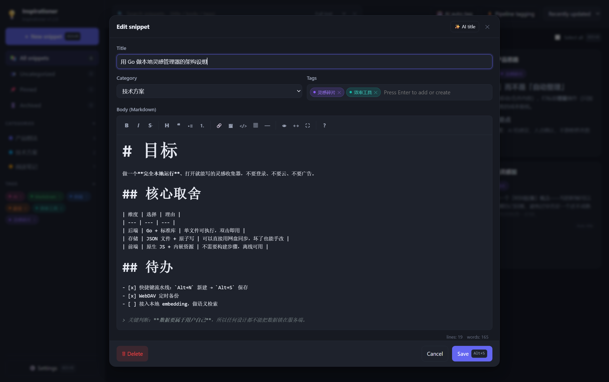
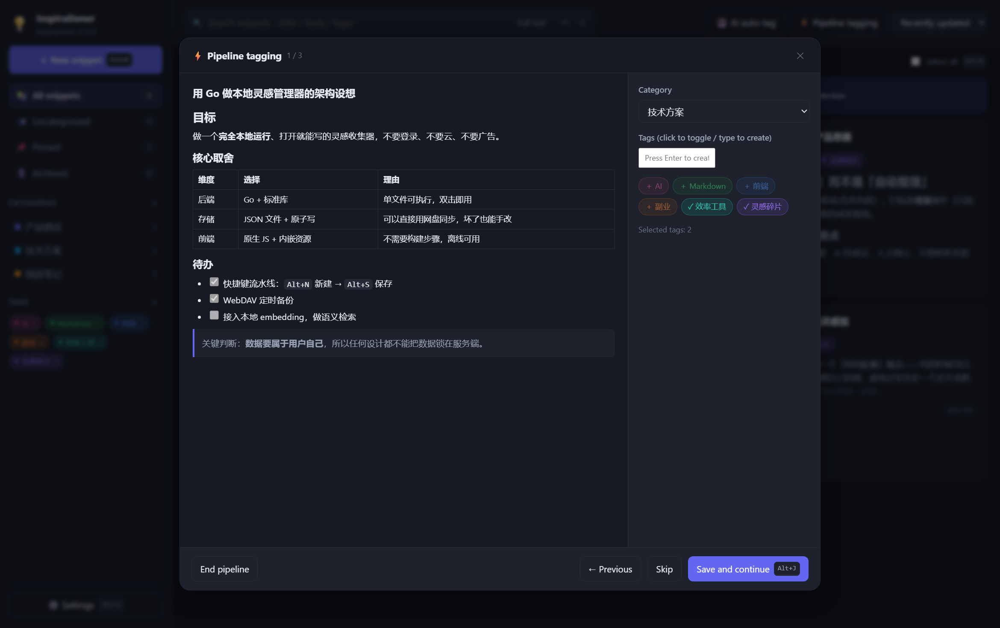
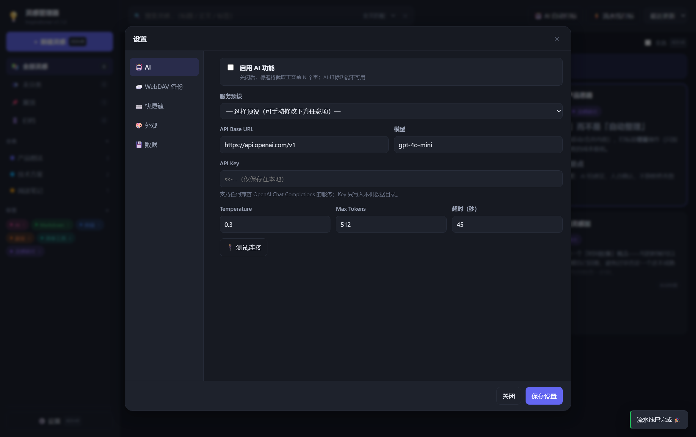
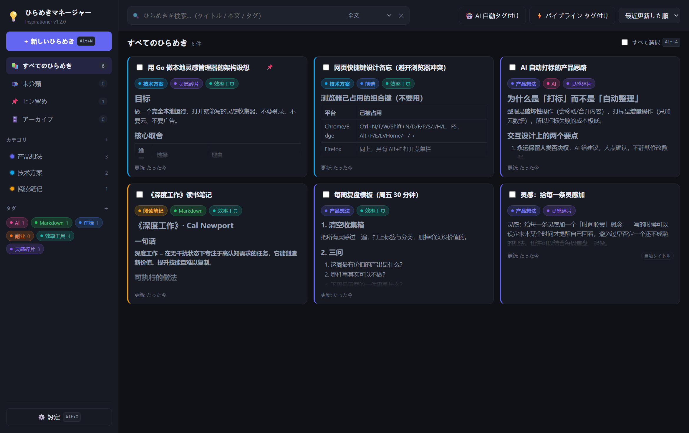
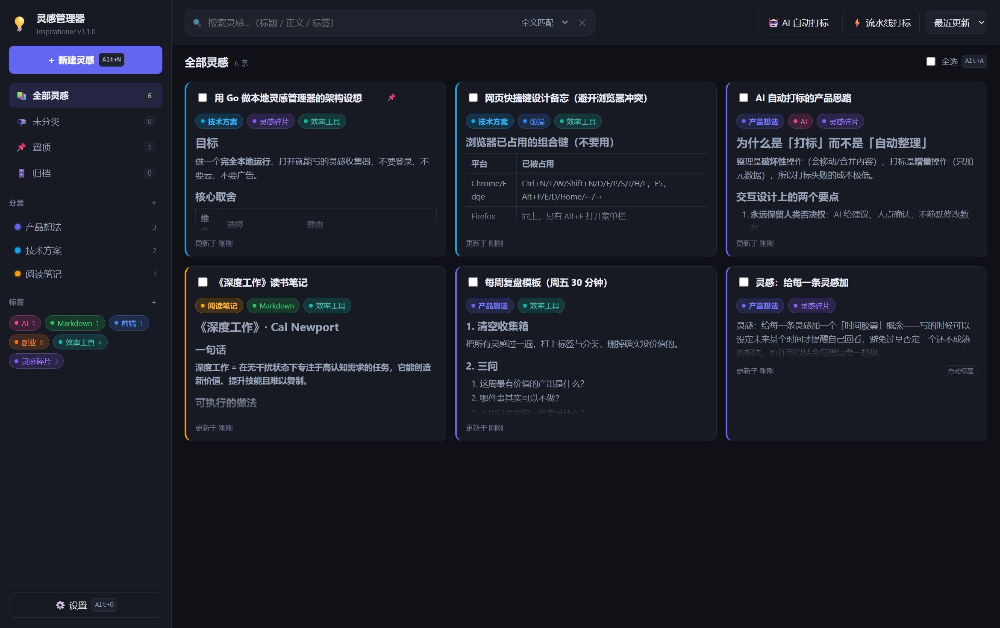

# 💡 灵感管理器 · Inspirationer

[English](README.md) | **简体中文** | [日本語](README.ja.md)

> Create, edit, tag, categorize, search — store your inspiration in a timely manner.
> 随手记录、打标签、分分类、随时搜回来：一个**完全本地运行**的灵感管理工具。


**Go 后端 + 浏览器前端**，编译出单个可执行文件：双击即用，**不弹黑色终端窗口**，常驻系统托盘，
启动后自动用你的默认浏览器打开界面。数据以 JSON 存在本地磁盘，支持 Markdown 编辑、
AI 自动标题、AI 自动打标、快捷键流水线、全文搜索、WebDAV 定时备份。

> 不需要 Node、不需要数据库、除 AI 功能外不需要联网。Go 侧**零第三方依赖**（只用标准库，
> 连系统托盘都是直接调 Win32 API 实现的）。

## 界面预览

| 主界面（卡片 / 分类 / 标签色块） | Markdown 编辑器 |
|---|---|
|  |  |

| 流水线打标（只读浏览 + 打标 + `Alt+J` 下一条） | 设置：AI / WebDAV / 快捷键 |
|---|---|
|  |  |

界面内置 **English / 简体中文 / 日本語** 三种语言，下面是同一屏的日语与中文效果：

| 日本語 | 简体中文 |
|---|---|
|  |  |

> 想立刻看到效果：运行 `node scripts/seed-demo.mjs` 会写入一份演示数据（6 条灵感、3 个分类、6 个标签），
> 不需要时全选删除即可。注意全新克隆的仓库**不含任何数据**（`data/` 不入库），首次启动就是一个空库。

---

## 目录

- [30 秒上手](#30-秒上手)
- [托盘图标与后台行为](#托盘图标与后台行为)
- [功能总览](#功能总览)
- [多语言](#多语言)
- [快捷键](#快捷键)
- [AI 配置](#ai-配置)
- [WebDAV 自动备份](#webdav-自动备份)
- [AI 自动打标 & 流水线打标](#ai-自动打标--流水线打标)
- [搜索](#搜索)
- [数据存放与备份](#数据存放与备份)
- [隐私与安全](#隐私与安全)
- [命令行参数](#命令行参数)
- [REST API](#rest-api)
- [开发与测试](#开发与测试)
- [架构说明](#架构说明)
- [第三方组件](#第三方组件)
- [常见问题](#常见问题)
- [许可证](#许可证)

---

## 30 秒上手

### 方式 A：直接下载可执行文件（推荐）

从 [Releases](../../releases) 下载 `inspirationer.exe`，或自行构建后直接双击：

1. 程序在后台启动本地服务（默认 `http://127.0.0.1:8420/`）；
2. **自动用你的默认浏览器打开界面**；
3. 屏幕右下角托盘区出现一个 💡 图标 —— 全程没有黑色终端窗口。

### 方式 B：从源码构建

```powershell
git clone https://github.com/idiomeo/inspirationer.git
cd inspirationer
.\build.ps1              # 构建 GUI 版（无控制台窗口）
.\inspirationer.exe      # 启动：自动开浏览器 + 托盘常驻
```

没有 PowerShell 也可以用原生命令：

```powershell
go build -trimpath -ldflags "-s -w -H=windowsgui" -o inspirationer.exe .
.\inspirationer.exe
```

默认端口 `8420`，被占用时自动顺延到 `8421`、`8422`…（日志里会打印真实地址）。

---

## 托盘图标与后台行为

| 操作 | 效果 |
|---|---|
| 左键单击 💡 | 打开界面（浏览器） |
| 右键 → 打开灵感管理器 | 同上 |
| 右键 → 打开数据目录 | 在资源管理器里打开 `data` 目录 |
| 右键 → 立即备份到 WebDAV | 立刻上传一次全库备份，结果用气泡提示 |
| 右键 → 查看日志文件 | 打开 `data\logs\inspirationer.log` |
| 右键 → 退出 | 优雅关闭服务并退出（数据落盘） |

其它行为：

- **重复启动不会起第二个服务**：再点一次 exe，它会发现已有实例并直接打开已有界面（`-single-instance=false` 可关掉）。
- **数据在程序同级的 `data\` 目录**，日志在 `data\logs\inspirationer.log`（超过 4MB 自动滚动为 `.1`）。
- **万一托盘不可用**（极少数受限环境，见[常见问题](#常见问题)），程序会自动打开日志控制台窗口并弹一次说明——服务照常运行，不会变成"看不见又退不掉"的进程。
- 需要看实时日志：用 `inspirationer-console.exe`，或给 exe 加 `-console`。

---

## 功能总览

| 能力 | 说明 |
|---|---|
| **灵感片段** | 点击「＋ 新建灵感」或按 `Alt+N`；标题可留空，正文支持完整 Markdown |
| **Markdown 编辑** | 内置开源编辑器 EasyMDE（CodeMirror + marked）：标题 / 列表 / 引用 / 代码块 / 表格 / 图片 / 预览 / 全屏，工具栏图标为内联 CSS 字形，不依赖 CDN |
| **自动标题** | 未填标题时：已配置 AI → 由 AI 总结生成；未配置 → 截取正文前 N 个字（默认 10，可改）。卡片上会标注标题来源 |
| **标签与分类** | 每条灵感可挂多个标签 + 1 个分类，色块 chip 显示在标题正下方；自动配色或自定义取色，侧栏右键即可改名改色 |
| **搜索** | 全文 / 仅标题 / 仅正文三档；多关键词 AND；可先在侧栏选分类或标签，实现「分类内单独搜索」 |
| **快捷键** | 全套可自定义（默认 `Alt` 组合，避开浏览器占用键），支持「新建 → 写 → 保存」的流水线式记录 |
| **AI 自动打标** | 勾选/全选灵感 → AI 逐条给出标签与分类建议 → 弹窗内可逐条勾选、追加或替换后再应用 |
| **流水线打标** | 选中灵感 → 逐条只读浏览 → 打标签/选分类 → `Alt+J` 下一条；每条即时落盘 |
| **全选** | 顶部「全选」复选框 / `Alt+A` / AI 弹窗内「全选建议」 |
| **整理** | 置顶 📌、归档 🗄️、批量归档/删除、按分类或标签筛选、三种排序 |
| **本地持久化** | JSON 文件实时原子写盘；每次保存写本地快照（保留 30 份）；文件损坏时启动自动回退到最近可用快照 |
| **WebDAV 备份** | 定时自动备份 + 立即备份 + 列远端备份 + 合并/覆盖恢复 + 远端份数自动清理 |
| **数据迁移** | 一键导出整库 JSON、导入（合并/覆盖），导入与恢复前自动创建本地快照 |
| **界面** | 深色/浅色主题、卡片 Markdown 预览开关、删除二次确认、侧栏实时统计 |

---

## 多语言

界面内置 **English / 简体中文 / 日本語**，语言就是一个普通设置项。

- **切换位置**：设置 → 🎨 外观 → **语言**。切换立即生效，不需要刷新。
- **跟随浏览器**（默认）：`auto` 会从 `navigator.languages` 里挑最匹配的一种（`zh-Hans` → 简体中文，`ja-JP` → 日本語），都不匹配时回落英文。
- **被翻译的内容**：所有标签、按钮、输入框占位符、Toast 提示、确认框、编辑器工具栏提示、相对时间（“3 分钟前” / “3 分前” / “3 minutes ago”）、**系统托盘菜单**、Windows 原生对话框，以及 **REST API 的错误信息**。
- **不翻译的内容**：你自己的内容 —— 灵感正文、标题、标签名、分类名。
- **持久化**：选择保存在 `data/settings.json` 的 `ui.language`，同时镜像到 `localStorage`，因此首屏渲染就已经是正确语言。

### 增加或改进一种语言

1. **前端文案**在 [`web/i18n.js`](web/i18n.js)：三份扁平字典，键为 `en` / `zh-CN` / `ja`。复制一份、翻译值、保留 key 与 `{占位符}`（`{n}` `{name}` `{time}`…）。缺失的 key 会自动回退到英文，所以可以只翻译一部分。
2. **后端文案**（API 错误、托盘菜单、原生对话框）在 [`internal/i18n/i18n.go`](internal/i18n/i18n.go)，结构是 `key → 语言 → 文本`。
3. 最后把新语言代码登记到 `SUPPORTED_LANGS`（`web/app.js`）、`i18n.Supported()`（`internal/i18n/i18n.go`）、`web/index.html` 的语言下拉框，以及 `internal/model/model.go` 里 `ui.language` 的白名单。

### 接口的语言协商

所有接口都按下面的优先级决定语言：

1. `X-Lang` 请求头（前端每次请求都会带上当前语言）；
2. `?lang=xx` 查询参数；
3. `Accept-Language` 请求头；
4. 都没有时用设置里的 `ui.language`，最后回落英文。

```bash
curl -s -X POST http://127.0.0.1:8420/api/ai/suggest \
  -H 'X-Lang: ja' -H 'Content-Type: application/json' -d '{"ids":["nope"]}'
# {"error":"AI 機能が無効です。先に「設定 → AI」で API を設定してください"}
```

---
## 快捷键

默认全部使用 `Alt` 组合，避开浏览器自带快捷键（`Ctrl+N/T/W/S/P/F/D`、`F5`、`Alt+F/E/D/Home/←/→` 等）。

| 动作 | 默认键 | 说明 |
|------|--------|------|
| 新建灵感 | `Alt+N` | 任意位置打开编辑窗口 |
| 保存灵感 | `Alt+S` | 编辑窗口内保存并关闭 |
| 聚焦搜索 | `Alt+K` | 跳到搜索框并全选内容 |
| 全选 / 取消全选 | `Alt+A` | 选中当前列表全部灵感 |
| 流水线下一条 | `Alt+J` | 保存当前条目并进入下一条 |
| 切换预览 | `Alt+P` | 编辑器 Markdown 预览 |
| 打开设置 | `Alt+O` | |
| 关闭弹窗 | `Escape` | 编辑器全屏时先退出全屏 |

**自定义**：设置 → ⌨️ 快捷键 → 点击输入框 → 直接按下组合键即可录制（`Backspace` 清空）。重复的快捷键会标红提示。

---

## AI 配置

设置 → 🤖 AI：

1. 勾选 **启用 AI 功能**；
2. 选一个「服务预设」，或手动填 `API Base URL` + `模型`；
3. 填 `API Key`；
4. 点 **🔌 测试连接** 确认可用。

内置预设（任何兼容 OpenAI `chat/completions` 协议的服务都能用）：

| 服务 | Base URL | 模型示例 |
|------|----------|----------|
| OpenAI | `https://api.openai.com/v1` | `gpt-4o-mini` |
| DeepSeek | `https://api.deepseek.com/v1` | `deepseek-chat` |
| Moonshot Kimi | `https://api.moonshot.cn/v1` | `moonshot-v1-8k` |
| 阿里通义 | `https://dashscope.aliyuncs.com/compatible-mode/v1` | `qwen-plus` |
| 智谱 GLM | `https://open.bigmodel.cn/api/paas/v4` | `glm-4-flash` |
| Ollama（本地） | `http://127.0.0.1:11434/v1` | `qwen2.5:7b` |
| One-API / New-API | `http://127.0.0.1:3000/v1` | 任意 |

> Ollama 等本地服务不需要 Key；Base URL 含 `localhost`/`127.0.0.1` 时允许留空。
> **API Key 只写入本机 `data/settings.json`**，该目录已被 `.gitignore` 忽略，不会进仓库、不会上传任何地方。

**AI 参与的三件事**：① 无标题时生成标题；② 批量生成标签与分类建议；③ 编辑器里的「✨ AI 生成标题」。

---

## WebDAV 自动备份

设置 → ☁️ WebDAV 备份：

| 字段 | 说明 |
|------|------|
| 启用自动备份 | 服务运行期间按间隔自动上传整库备份 |
| WebDAV 地址 | 例如坚果云 `https://dav.jianguoyun.com/dav/` |
| 用户名 / 密码 | 坚果云、Nextcloud 等请用**应用密码**，不是登录密码 |
| 远端目录 | 默认 `inspirationer`，不存在会自动 MKCOL 创建 |
| 自动备份间隔 | 单位分钟，默认 60 |
| 远端最多保留份数 | 超出后自动删除最旧的备份（默认 10） |

常用服务地址：

- **坚果云**：`https://dav.jianguoyun.com/dav/`（账号邮箱 + 应用密码）
- **Nextcloud / ownCloud**：`https://你的域名/remote.php/dav/files/用户名/`
- **群晖 Synology**：`https://你的域名:5006/灵感备份/`（WebDAV Server 套件）
- **Alist**：`http://127.0.0.1:5244/dav/`
- **通用 WebDAV**：任意支持 `PROPFIND/PUT/GET/MKCOL/DELETE` 的地址

按钮：**测试连接**（可用未保存的表单值测试）、**立即备份**、**从远端恢复**（逐条提供「合并恢复」与「覆盖恢复」，覆盖前自动创建本地快照）、**创建本地快照**。

远端文件名：`inspirationer-backup-YYYYMMDD-HHMMSS.json`，另有 `latest.json` 始终指向最新备份。

---

## AI 自动打标 & 流水线打标

两者都是**用户主动点击**才触发。先勾选灵感，或点顶部「全选」/ 按 `Alt+A`。

### 🤖 AI 自动打标（批量）

1. 勾选若干灵感（可全选）；
2. 点工具栏或批量条上的「🤖 AI 自动打标」；
3. AI 逐条阅读内容，弹窗给出建议：标题、2~4 个标签、1 个分类、一句话摘要；
4. 可逐条取消勾选、逐个标签取消、切换「追加 / 替换」标签模式，或「全选建议」；
5. 点「应用勾选的建议」写入。

AI 会拿到「已有标签 / 已有分类」列表，优先**复用已有标签**（忽略大小写），确实需要时才新建并自动分配颜色。

### ⚡ 流水线打标（逐条）

1. 勾选要处理的灵感 → 点「⚡ 流水线打标」；
2. 左侧只读展示当前灵感的 Markdown 内容，右侧选择分类、点选或新建标签；
3. 按 `Alt+J`（或点「保存并进入下一条」）→ 立即写入当前条目并跳到下一条；
4. 「跳过」不保存直接下一条，「← 上一条」回退，「结束流水线」随时退出。

进度显示在标题右侧（如 `3 / 12`），每条保存即时生效，中途关闭也不会丢。

---

## 搜索

顶部搜索框（`Alt+K` 聚焦）：

- **范围选择**：`全文匹配`（标题 + 正文 + 标签名 + 分类名）、`仅标题`、`仅正文`；
- **多关键词**：空格分隔，要求**全部命中**，例如 `markdown 写作`；
- **作用域**：先点侧栏某个分类 / 标签，再搜索 → 即「在某个分类中单独搜索」；
- 大小写不敏感；输入即搜（220ms 防抖）；点 ✕ 清空。

侧栏快捷视图：全部灵感、未分类、置顶、归档。

---

## 数据存放与备份

默认数据目录是程序旁边的 `./data`（可用 `-data` 指定；若当前目录不可写会自动退回 exe 同级目录）。

```
data/
├── snippets.json      # 所有灵感（标题、正文、标签 ID、分类 ID、时间戳、标题来源）
├── tags.json          # 标签（名称 + 颜色）
├── categories.json    # 分类（名称 + 颜色）
├── settings.json      # AI / WebDAV / 快捷键 / 外观（⚠️ 可能含 API Key 与 WebDAV 密码）
├── runtime.json       # 运行期状态（进程号与访问地址，用于单实例识别）
├── logs/
│   └── inspirationer.log
└── backups/
    └── snapshot-YYYYMMDD-HHMMSS.json   # 本地快照，保留最近 30 份
```

- 所有写操作都是「临时文件 + 原子重命名」，且每次改动立即写盘；
- 启动时若距上次快照超过 6 小时会自动补一份；
- 设置 → 💾 数据：可**导出整库备份**（浏览器下载 JSON）、**导入备份**（合并 / 覆盖）；
- 导入与恢复前都会自动创建本地快照，方便回滚。

---

## 隐私与安全

- **数据完全属于你**：所有灵感、标签、分类、设置都存在本机 `data/` 目录，程序不含任何统计、遥测或后台上报。
- **不联网**：只有在你主动使用 AI 功能（调用你配置的 API）或 WebDAV 备份时才会发起网络请求。
- **密钥不出本机**：AI API Key 与 WebDAV 密码只写入 `data/settings.json`；`.gitignore` 已排除 `data/`、`logs/`、`release/`，因此**不会**被提交到仓库。
- **前端全离线**：EasyMDE / marked / DOMPurify 全部内置于二进制内，页面不引用任何 CDN；Markdown 渲染结果会经 DOMPurify 过滤，避免 XSS。
- **服务默认只监听 `127.0.0.1`**，且**没有登录鉴权**（定位是本机单用户工具）。若要 `-addr 0.0.0.0:8420` 暴露到局域网/公网，请自行加反向代理与认证。
- **本仓库不含任何密钥或个人信息**，`git log` 中也没有（`data/` 从未入库）。
- **漏洞上报**：见 [SECURITY.md](SECURITY.md)；请用 GitHub 的私密漏洞上报（**Security** 标签页），不要开公开 issue。
- 仓库公开后，每次推送到 `main` 都会在 CI 里跑 **CodeQL** 静态安全扫描。

如果你要把自己的 `data/` 目录分享出去做备份，请先检查 `settings.json` 里的密钥；更推荐用程序内的「导出整库备份」并注意脱敏。

---

## 命令行参数

```
inspirationer.exe [flags]

  -addr string              监听地址（默认 "127.0.0.1:8420"，被占用时自动顺延）
  -data string              数据目录（默认 "./data"，不可写时退回 exe 同级目录）
  -open                     启动成功后自动打开浏览器（默认 true）
  -tray                     显示系统托盘图标（默认 true，Windows）
  -console                  额外显示控制台窗口以查看实时日志（GUI 版默认没有控制台）
  -single-instance          只允许一个实例，重复启动会打开已有实例（默认 true）
  -dev-web string           从磁盘目录加载前端资源（开发调试用，默认用内嵌资源）
  -version                  打印版本号
```

例：

```powershell
# 换个端口 + 数据放到 D 盘 + 不自动开浏览器
.\inspirationer.exe -addr 127.0.0.1:9000 -data D:\灵感数据 -open=false

# 局域网访问（注意：没有登录鉴权，公网暴露前请自行加反代与认证）
.\inspirationer.exe -addr 0.0.0.0:8420

# 想看实时日志
.\inspirationer.exe -console
```

---

## REST API

前端是一个纯静态页面，所有能力都通过 REST API 暴露，方便脚本化 / 二次开发：

| 方法 | 路径 | 说明 |
|------|------|------|
| GET | `/api/bootstrap` | 一次性拉取设置、标签、分类、统计 |
| GET | `/api/snippets` | 列表 / 搜索，支持 `query` `mode` `categoryId` `tagIds` `archive` `sort` `limit` |
| POST | `/api/snippets` | 新建（`title` 留空时自动生成标题） |
| GET/PUT/DELETE | `/api/snippets/{id}` | 单条读取 / 整体更新 / 删除 |
| PATCH | `/api/snippets/{id}` | 局部更新（`title` `content` `tags` `categoryId` `pinned` `archived` `addTags`） |
| POST | `/api/snippets/bulk` | 批量：`delete` `assign` `archive` `unarchive` `pin` `unpin` |
| GET/POST | `/api/tags`、`/api/categories` | 列表 / 新建 |
| PUT/DELETE | `/api/tags/{id}`、`/api/categories/{id}` | 改名改色 / 删除 |
| GET/PUT | `/api/settings` | 读取 / 保存设置 |
| POST | `/api/ai/title` | 生成标题 |
| POST | `/api/ai/suggest` | 批量生成标签与分类建议 |
| POST | `/api/ai/apply` | 应用建议 |
| POST | `/api/ai/test` | 测试 AI 连通性 |
| POST | `/api/webdav/test` \| `/api/webdav/backup` \| `/api/webdav/restore` | 测试 / 备份 / 恢复 |
| GET | `/api/webdav/list` | 远端备份列表 |
| GET | `/api/backup/export` \| POST `/api/backup/import` \| POST `/api/backup/local` | 导出 / 导入 / 本地快照 |
| GET | `/api/stats` | 统计信息 |

示例：

```bash
curl -X POST http://127.0.0.1:8420/api/snippets \
  -H "Content-Type: application/json" \
  -d '{"content":"随手记：用 WebDAV 做灵感备份","tags":[],"categoryId":""}'
```

---

## 开发与测试

```powershell
.\build.ps1              # GUI 版（-H=windowsgui，无控制台窗口）
.\build.ps1 -Console     # 额外产出 inspirationer-console.exe（带控制台，便于排查）
.\build.ps1 -Icon        # 重新生成图标与 Windows 资源（需要 python + Pillow + rsrc）
.\dev.ps1                # 开发模式：前端直接从 web/ 读取，改完刷新浏览器即可（无需重编）
.\scripts\make-release.ps1   # 构建 + 组装 release/ + 生成可直接上传 GitHub Release 的 zip
```

> 如果 PowerShell 提示脚本“未进行数字签名”无法运行，见[常见问题](#常见问题)。

**打包发布**

```powershell
.\scripts\make-release.ps1            # 先构建再打包
.\scripts\make-release.ps1 -SkipBuild # 只用现有 exe 打包
```

`release/` 会变成一个可以直接上传的完整发布包：

```
release/
├── inspirationer.exe                            主程序（GUI、托盘、无控制台窗口）
├── inspirationer-console.exe                    调试版（带控制台）
├── start-inspirationer.bat                      双击启动（刻意只用 ASCII，避免 cmd 解析问题）
├── README.md  LICENSE                           文档与许可
├── HOW-TO-RUN.txt                               三语快速上手
├── inspirationer-v<版本>-windows-amd64.zip       ← 上传到 GitHub Release 的就是这个
└── SHA256SUMS.txt                               上面这些文件的校验和
```

**测试**（需要先启动服务；AI/WebDAV/UI 测试还需要模拟服务）：

```powershell
# 终端 1：服务（测试时关掉托盘与自动开浏览器，避免打扰）
.\inspirationer.exe -open=false -tray=false

# 终端 2：模拟 AI + 模拟 WebDAV（仅测试用，全部是本地假凭据）
node scripts\mock-services.mjs

# 终端 3：跑测试
node scripts\check-i18n.mjs         # 文案完整性：282 个 key × 英/中/日
go test ./...                      # 单元测试：托盘结构体布局、ICO 解析、Win32 函数解析自检
node scripts\api-smoke.mjs         # 62 项：CRUD、标签分类、搜索、批量、备份导入导出、后端多语言
node scripts\ai-webdav-test.mjs    # 33 项：AI 标题、AI 打标、WebDAV 备份/清理/恢复
node scripts\ui-test.mjs           # 61 项：无头浏览器驱动真实 UI（含快捷键、可见性与语言切换）
node scripts\auto-backup-test.mjs  # 定时自动备份（约 1~2 分钟）
```

- `ui-test.mjs` 会自动查找 Edge/Chrome，用 CDP 驱动无头浏览器，验证渲染、快捷键、AI 弹窗、流水线、设置面板，**在英/中/日三种语言间切换并校验没有翻译 key 泄漏到界面、语言设置在刷新后仍生效**，并断言**无未捕获 JS 异常与 console.error**；
- `go test` 里的 `TestWin32ProcsResolve` 会逐个解析所有用到的 Win32 函数，**DLL 写错或函数名拼错会直接测试失败**（而不是等到运行时 panic）；
- 想真正建一个托盘图标验证（会在通知区留下图标，随后自动移除）：

```powershell
$env:IH_TRAY_TEST=1; go test ./internal/tray/ -run TestTrayStartInThisEnvironment -v
```

---

## 架构说明

```
inspirationer/
├── main.go                     # 入口：参数、单实例、托盘、日志文件、内嵌前端、优雅关闭
├── assets/                     # app.ico + app.manifest（编译进 exe 的图标与清单）
├── rsrc_windows_amd64.syso     # 由 rsrc 生成，go build 自动链接（图标 / 清单 / DPI 感知）
├── internal/
│   ├── model/model.go          # 数据结构与默认设置
│   ├── store/store.go          # JSON 持久化、查询、批量操作、备份导入导出
│   ├── ai/ai.go                # OpenAI 兼容客户端（标题生成 / 结构化打标建议）
│   ├── webdav/webdav.go        # WebDAV 客户端（MKCOL/PUT/GET/PROPFIND/DELETE）
│   ├── server/server.go        # 路由与全部 HTTP 处理器
│   ├── i18n/i18n.go            # 后端文案表（en / zh-CN / ja）与错误码
│   ├── platform/               # Win32 小工具：消息框 / 打开链接 / 单实例 / 控制台 / DPI
│   └── tray/                   # 系统托盘图标与右键菜单（纯 syscall，无第三方库）
├── web/                        # 前端（原生 JS，无构建步骤）
│   ├── index.html  styles.css  app.js
│   ├── i18n.js                 # 界面文案：en / zh-CN / ja
│   └── vendor/                 # EasyMDE + marked + DOMPurify（本地内置，离线可用）
├── scripts/                    # 测试脚本 + 图标生成脚本
└── docs/                       # 界面截图
```

几点设计取舍：

- **单文件分发**：前端用 `go:embed` 打进二进制，双击 exe 即可用，不需要附带资源目录；
- **零第三方 Go 依赖**：托盘、消息框、单实例、打开浏览器全部用标准库 `syscall` 直接调 Win32，避免 CGO 与依赖树；
- **数据可迁移性优先**：用人类可读的 JSON 而不是数据库，坏了一个文件也能手改，还能直接丢进网盘同步；
- **写盘安全**：临时文件 + 原子重命名 + 本地快照 + 损坏自动回退。

---

## 第三方组件

前端仅内置以下开源库（均为本地文件，无 CDN 依赖）：

| 组件 | 版本 | 用途 | 许可 |
|------|------|------|------|
| [EasyMDE](https://github.com/Ionaru/easy-markdown-editor) | 2.18.0 | Markdown 编辑器（内置 CodeMirror + marked） | MIT |
| [marked](https://github.com/markedjs/marked) | 12.0.2 | 卡片预览的 Markdown 渲染 | MIT |
| [DOMPurify](https://github.com/cure53/DOMPurify) | 3.1.6 | 渲染结果 XSS 过滤 | Apache-2.0 / MPL-2.0 |

Go 侧无第三方依赖；托盘图标、消息框、单实例、打开浏览器等全部通过标准库 `syscall` 直接调用 Win32 API。

---

## 常见问题

**Q：双击后没有黑窗口，怎么知道程序在跑？**
看屏幕右下角托盘区的 💡 图标（Windows 11 可能把它收进「显示隐藏的图标」，可以拖出来固定）。日志在 `data\logs\inspirationer.log`。

**Q：怎么退出？**
右键托盘图标 → 退出。也可以用 `inspirationer-console.exe` 或 `-console` 启动后按 `Ctrl+C`，或在任务管理器里结束进程（数据已实时落盘，不会丢）。

**Q：浏览器没自动打开？**
① 看日志里有没有"已请求系统默认浏览器打开"；② 手动访问日志里的地址即可；③ 用 `-open=false` 启动时不会打开，这是预期的。

**Q：托盘图标注册失败怎么办？（日志出现 `Shell_NotifyIcon ... Access is denied`）**
这是运行环境的完整性级别限制：Windows 的 UIPI 规则不允许**低完整性级别**进程向资源管理器注册托盘图标。日志里的诊断会写明 `integrity=Low`。常见于沙箱 / 受限容器 / 某些以低权限令牌拉起的自动化环境；**在普通桌面双击运行不会有这个问题**（日志会显示 `tray icon ready`）。程序在这种情况下会自动打开日志控制台并提示，服务本身不受影响。

**Q：端口被占用？**
日志里会打印实际地址（自动顺延端口）；也可以用 `-addr 127.0.0.1:9000` 指定。

**Q：能局域网访问吗？**
`-addr 0.0.0.0:8420` 即可，但注意本工具**没有登录鉴权**（定位是本机单用户工具），暴露到公网前请自行加反向代理与认证。

**Q：数据会丢吗？**
每次改动都立即原子写盘；`data/backups/` 保留 30 份本地快照；文件损坏时启动会自动回退到最近可用快照。再配合 WebDAV 自动备份基本无风险。

**Q：快捷键没反应？**
① 浏览器窗口需处于聚焦状态；② 部分浏览器会把 `Alt` 组合用于菜单，若冲突请改成 `Alt+Shift+X` 之类；③ 有弹窗打开时只响应弹窗内快捷键（这是刻意的，避免误操作），`Esc` 可随时关闭弹窗。

**Q：PowerShell 提示 `.ps1` 脚本“未进行数字签名”，不让运行？**
这是执行策略（execution policy）拦住了未签名脚本。可以绕过执行，或在下载后解除锁定一次：

```powershell
powershell -ExecutionPolicy Bypass -File .\build.ps1
# 或者对克隆/解压出来的整份代码解除锁定：
Get-ChildItem -Recurse -Include *.ps1 | Unblock-File
```

其实**不用这些脚本也能构建**：[30 秒上手](#30-秒上手) 里给了等价的 `go build` 命令；而
`启动灵感管理器.bat` 与 `start-inspirationer.bat` 是普通 cmd 批处理，不受 PowerShell 策略影响。
（`.ps1` 文件都带 UTF-8 BOM，这样 Windows PowerShell 5.1 也能正确读取其中的中文注释。）

**Q：AI 打标要花钱吗？**
取决于你选的服务；用 Ollama 本地模型可以完全免费离线。不做任何操作时不会调用 AI。

**Q：怎么完全重置？**
右键托盘 → 退出，然后删除 `data/` 目录，重新启动即可。

---

## 许可证

本项目采用 **Apache License 2.0**，见 [LICENSE](LICENSE)。

第三方前端组件的许可见上文[第三方组件](#第三方组件)（MIT / Apache-2.0 / MPL-2.0），
它们以未修改的原始形式内置于 `web/vendor/`。
